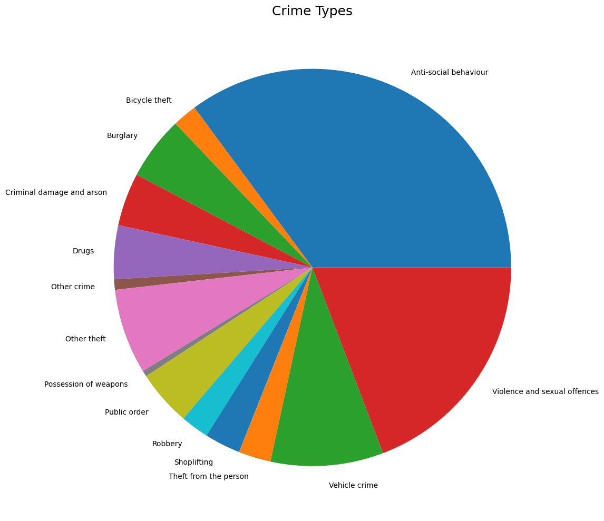
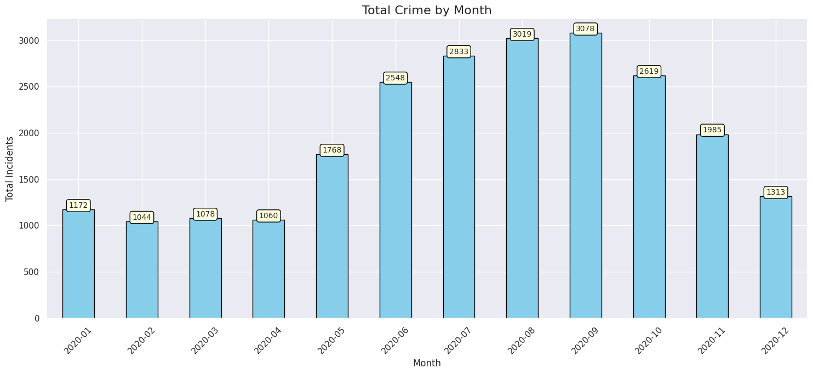
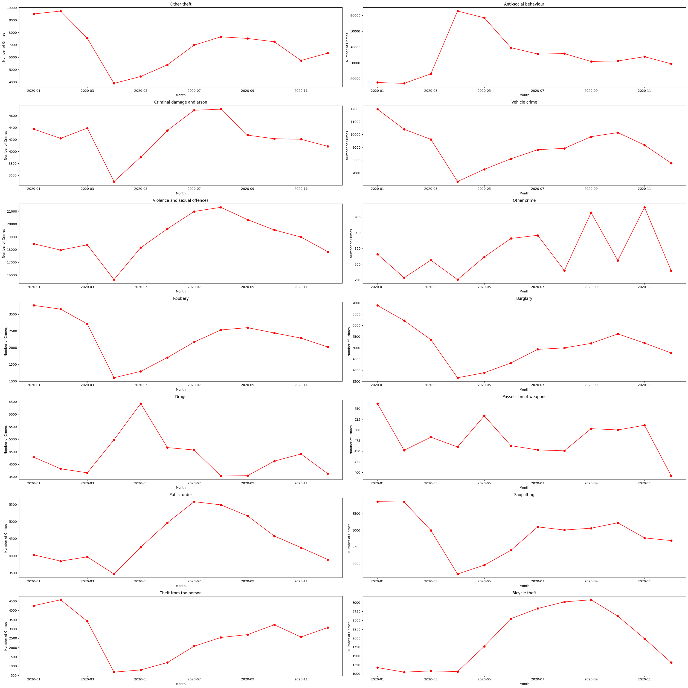

# Crime Data Analysis: UK Metropolitan Police Data

## Project Overview

The dataset contains information about crime incidents reported by the Metropolitan Police Service in the UK for each month of 2020. The analysis aims to explore different aspects of the crime data, such as crime types, monthly crime trends, and comparisons across different crime categories. The goal is to visualize and interpret trends to better understand patterns and provide insights for policy or resource allocation.

## Features & Techniques

1. **Data Download and Merging**:
   - Multiple CSV files from the UK police data repository are downloaded and merged into a single DataFrame using `pandas`. This provides an aggregated dataset for analysis.

2. **Crime Type Analysis**:
   - A pie chart visualizes the distribution of different crime types.
   - A more aesthetic version of the pie chart is generated with customized wedge and text properties.

3. **Monthly Crime Trend Analysis**:
   - A bar chart is generated to display the total number of crimes for each month.
   - A line plot is also used to track trends over time.

4. **Crime Type Over Time**:
   - A grid of subplots is created to show crime trends for each specific crime type across the months of 2020.
   - Each crime type’s monthly trend is visualized with a line plot.

5. **Bar Chart with Annotations**:
   - A bar chart with crime data by month, enhanced by annotations on top of each bar, providing exact numbers for better readability.

6. **Visualization Enhancements**:
   - Various visualization improvements using `seaborn` and `matplotlib`, such as customized axis labels, title fonts, and annotations with a distinct box style.

## Data Analysis & Visualizations

### 1. **Crime Types Distribution**
   - The pie chart visualizes the distribution of crime types across the dataset.
   - The code uses `matplotlib` to generate the chart, enhancing it with customizations for the appearance of wedges and text.

   

### 2. **Total Crime by Month**
   - The number of crimes is plotted for each month in a bar chart format, showing fluctuations and trends across the months.

   

### 3. **Crime Trends for Specific Crime Types**
   - A set of line plots, each representing a different crime type, is generated. These plots show how the number of crimes for each category changes over the months.

   

